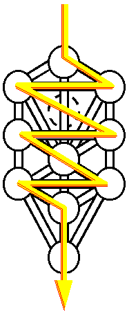

# Forage

> *Forage is for Storage*

- Remote storage: Open storage channels to a remote storage provider over Tor
- Lightweight: Platform-optimized using Blake3-based hash, verified streaming, and encryption algorithms
- Local files can be deleted: Periodic verification of remotely stored data
- Remote files can be retrieved: Files can be proven to exist remotely and sent back
- Low write-amplification: Bytes stored are only slightly larger than bytes read

**Caution!** This is experimental, potentially dangerous technology that hasn't yet been audited!

## Notable Dependencies

- Embedded
    - [x] [Blake3 cryptographic hash algorithm](https://github.com/BLAKE3-team/BLAKE3)
    - [x] [Bao Verified Streaming for Provable Data Possession](https://github.com/oconnor663/bao)
    - [ ] [XChaCha8Blake3Siv encryption](https://github.com/PaulGrandperrin/XChaCha8Blake3Siv)
    - [ ] [Torut Tor controller](https://lib.rs/crates/torut)
    - [ ] [zstd_safe dictionary compression](https://github.com/gyscos/zstd-rs)
    - [x] [Rusqlite embedded SQL database](https://github.com/rusqlite/rusqlite)
    - [x] [Sled embedded keystore](https://github.com/spacejam/sled)
- External
    - Local Tor SOCKS proxy

## Roadmap

### 0.0.1 - Experiment

- [x] Bao encoding
- [x] Bao verification
- [x] Bao extraction

### 0.0.2 - File storage

- [x] Sled for path lookup
- [x] `file` SQL
    - [x] Schema
    - [x] Insert
    - [x] Query
- [x] Encode files in the `Forage Data` folder, and store them in a configured storage volume
- [x] Decode files stored in a configured storage volume, and restore them to the `Forage Data` folder
- [x] Verify a random slice of a file (accounting for files of varying sizes)
- [x] Display encoded file list
- [x] Paths are indexed in sqlite (path, file name, file size, creation & modification dates, file hash)
- [x] Multiple files can be stored

### 0.0.3 - Crate & Testing

- Exports all CLI commands as functions
- Serial integration tests added for crate
- Needs more documentation and tests

### 0.0.4 - Tor networking

- [ ] Generate Onion v3 address
- [ ] `peer` SQL
    - [x] Schema
    - [ ] Insert
    - [ ] Query
- [ ] Open & Receive TCP socket over Tor hidden service

### 0.0.5 - Authenticated encryption

- [ ] Authentication between storage client and storage provider using Onion v3 addresses
- [ ] Blake3 keyed hashes as a MAC
- [ ] Files are encrypted using XChaCha8Blake3Siv authenticated encryption
    - **Caution!** Experimental encryption!
- [ ] CSPRNGs where RNGs are used
- [ ] Use randomized padding instead of zeroed padding
- [ ] Zeroization of private keys after dropped from memory

### 0.1.0 - Proof of Concept

Goal: A storage client that can compress, encrypt, and store data on a remote storage provider using Tor. The storage client can check periodically that the data is still present and consistent on the remote storage provider against only a local 32-byte Blake3 hash without a full local reference copy, allowing the client to delete its local data, trusting that it can retrieve it later in-full. The storage client can then retrieve the data from the storage provider and decode it on-disk.

- [ ] Storage client can open a storage channel to storage provider over Tor
    - [ ] Storage provider generates Onion v3 address to provide to storage client out-of-band
    - [ ] Storage client generates Onion v3 address of their own
    - [ ] TCP socket is established from storage client to storage provider over Tor hidden service
- [ ] Storage client can store data on storage provider
    - [ ] Storage client can supply their node with specified path to data to store remotely
    - [ ] Data is encoded using Bao, hashed with Blake3, and transmitted over TCP socket over Tor circuit
    - [ ] Blake3 hash is persisted locally
    - [ ] Optional: Delete the local data
- [ ] Storage client can periodically verify the data they sent is still present and consistent over time
    - [ ] Storage client asks for a 4KB slice of data at a random offset of their choosing from the storage storage provider
    - [ ] Storage client checks 4KB slice against the same offset against local Bao Blake3 hash
- [ ] Storage client can retrieve data from storage provider over storage channel
    - [ ] Data is written to disk at specified path
- [ ] Files are compressed using zstd dictionary compression
- [ ] Individual files can be retrieved from storage provider
- [ ] Files can be removed
- [ ] Files can be overwritten, with old revisions still retrievable
- [ ] The number of older revisions can be configured
- [ ] Embeddable library available, with documentation
- [ ] Parallel processing for lots of files

### 0.1.1

- [ ] Complex volume and storage layouts

### Future

After this basic functionality exists, more exciting features are planned, including apps on the [Start9 Embassy](https://start9.com) and [Umbrel](https://getumbrel.com)!

